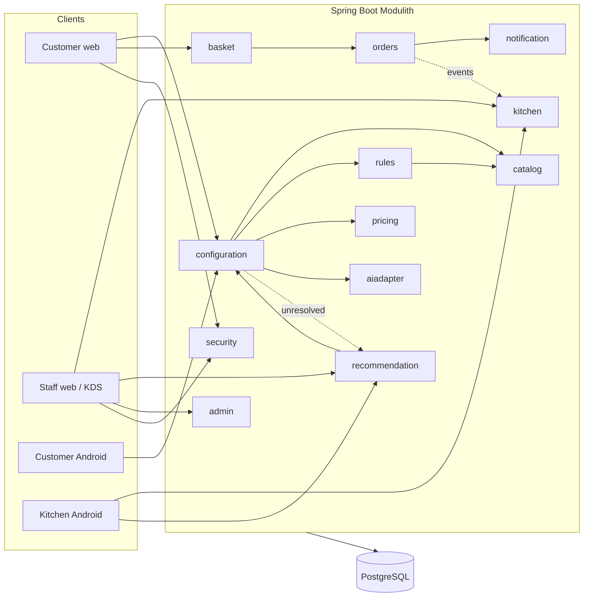

# Pizza Configurator

A full-stack pizza ordering platform: a customer-facing configurator that lets
a customer build a custom pizza (with an optional free-text comment that gets
interpreted automatically), a kitchen display system (KDS) for staff to run
the order pipeline, an admin portal for managing the catalog/pricing/business
rules, and native Android apps mirroring both the customer and kitchen web
experiences.

The backend is a **modular monolith**: a single deployable Spring Boot
application internally organized into independent, loosely-coupled business
modules with enforced boundaries, rather than either a single unstructured
codebase or a distributed microservices system.

## Table of contents

- [Requirements](#requirements)
- [Architecture](#architecture)
- [Tech stack](#tech-stack)
- [Project structure](#project-structure)
- [Getting started](#getting-started)
- [Testing](#testing)
- [CI/CD](#cicd)
- [Environment variables](#environment-variables)
- [Observability](#observability)

## Requirements

### Functional requirements

| ID | Requirement | Priority |
|----|-------------|----------|
| FR-01 | Select a standard pizza (e.g. Margherita, Hawaii, Napoli) | Must |
| FR-02 | Choose size and dough type | Must |
| FR-03 | Add or remove allowed ingredients and set quantities | Must |
| FR-04 | Add an optional free-text comment; when present, parse it before rule validation | Should |
| FR-05 | Validate each configuration against business rules | Must |
| FR-06 | Suggest valid alternatives where possible | Should |
| FR-07 | Calculate the total price dynamically | Must |
| FR-08 | Confirm the final price before creating the order | Must |
| FR-09 | Allow kitchen staff to review unresolved requests | Must |
| FR-10 | Allow kitchen staff to update order status in the KDS | Must |
| FR-11 | Allow administrators to manage catalog, prices, rules and users | Must |
| FR-12 | Notify the customer when action or pickup is required | Should |

### Non-functional requirements

| ID | Requirement | Category |
|----|-------------|----------|
| NFR-01 | Fast response for configuration, validation and pricing | Performance |
| NFR-02 | Ordering remains available during business hours | Availability |
| NFR-03 | Kitchen and admin functions require secure access | Security |
| NFR-04 | Duplicate order creation is prevented | Reliability |
| NFR-05 | Support concurrent customer sessions | Scalability |
| NFR-06 | Keep clear boundaries between business modules | Maintainability |
| NFR-07 | Cover core business logic with automated tests | Quality |
| NFR-08 | Make failures observable through logs and metrics | Observability |

How each requirement is met, in brief:

- **FR-01–FR-03**: the catalog module serves pizzas, ingredients, sizes and
  doughs; the configurator UI (web and native) builds a `ConfigurationSession`
  from the customer's selections.
- **FR-04**: a non-blank comment is sent to the AI adapter module (Deepseek
  primary, OpenAI fallback) before rule validation; a successfully-parsed
  comment is merged into the structured selection and validated exactly like
  a manual pick — the AI's output is never trusted just because it parsed.
- **FR-05–FR-06**: the rules module runs every applicable rule (nine rule
  types — quantity limits, exclusions, compatibility, removability, option
  gating) against the candidate configuration and returns violations plus,
  where a deterministic fix exists, a suggestion.
- **FR-07–FR-08**: the pricing module computes a price only from an already
  `VALID` configuration; the customer sees and confirms the total before an
  order can be created.
- **FR-09**: anything the AI adapter can't resolve, or that fails validation
  with no deterministic suggestion, is escalated to a kitchen review queue —
  staff can accept it as-is, propose an alternative, or reject it.
- **FR-10**: the KDS drives a four-stage order state machine
  (confirmed → approved → in processing → ready → completed) with
  live updates over Server-Sent Events.
- **FR-11**: the admin portal covers pizzas (incl. photos), ingredients,
  sizes, doughs, recipes, rules, prices, staff accounts, app-distribution
  links, and an audit log of every admin change.
- **FR-12**: order-lifecycle events fan out to email (when a customer has one
  on file) and push notifications (when a device token is present), each
  recorded and neither blocking the other or the order itself.
- **NFR-01/NFR-05**: the write paths involved (validate, price, add to
  basket) do no blocking I/O beyond the database, and every customer flow is
  stateless behind a JWT, so it scales horizontally without sticky sessions.
- **NFR-02/NFR-04**: order creation requires an idempotency key — a retried
  request with the same key and body replays the original order rather than
  creating a duplicate.
- **NFR-03**: kitchen and admin endpoints are deny-by-default behind
  role-based Spring Security rules (`ROLE_KITCHEN`/`ROLE_ADMIN`), backed by
  self-issued, stateless JWTs.
- **NFR-06**: module boundaries are structurally enforced in CI — a build
  fails if one module reaches into another's internals or a dependency cycle
  is introduced.
- **NFR-07**: unit tests for every rule evaluator and domain object, plus
  integration tests (against a real PostgreSQL instance, not an in-memory
  substitute) for every module's critical path, and an end-to-end browser
  test suite covering the full customer/staff/admin flows.
- **NFR-08**: structured JSON logs, Prometheus metrics with latency
  histograms, and OpenTelemetry tracing (dormant until a collector endpoint
  is configured).

## Architecture

The backend is one Spring Boot process split into independently-versioned,
independently-tested business modules, each owning its own database schema
and exposing only a small, explicit published interface for other modules to
call — enforced by a structural verification test that fails the build on a
boundary violation or a dependency cycle.

| Module | Responsibility |
|--------|-----------------|
| `security` | Customer and staff authentication, JWT issuance, role-based access control |
| `catalog` | Pizzas, ingredients, sizes, doughs, recipes, pizza photos — the menu itself |
| `configuration` | Orchestrates one customer's in-progress pizza build: selections, comment interpretation, validation, pricing |
| `rules` | The business-rule engine — nine admin-configurable rule types, evaluated deterministically |
| `pricing` | Deterministic price calculation from a validated configuration |
| `basket` | Pre-checkout cart — holds immutable snapshots of priced configurations |
| `orders` | Order lifecycle and state machine, idempotent creation, guest/customer access control |
| `kitchen` | KDS read/action endpoints and the live order-stream (SSE) |
| `notification` | Fans order-lifecycle events out to email and push, independently per channel |
| `aiadapter` | Provider-agnostic free-text comment interpretation (Deepseek → OpenAI fallback) |
| `recommendation` | Kitchen-side triage queue for anything the system couldn't resolve automatically |
| `admin` | Audit log of admin changes, and Android app-distribution link management |
| `shared` | Cross-cutting configuration (CORS, clock, auditing) with no business logic of its own |



Cross-module reactions (e.g. "an order became ready" → notify the customer)
are handled with Spring application events rather than direct calls, so a
module never needs to know who, if anyone, reacts to something it publishes.

## Tech stack

**Backend**
- Java 21, Spring Boot 4.0.7, Spring Modulith 2.1.0
- Spring Data JPA / Hibernate, Spring Security (stateless JWT)
- PostgreSQL 16, Flyway (one schema per module)
- JUnit 5, Testcontainers (real PostgreSQL in tests, not an in-memory substitute)
- Micrometer + Prometheus, OpenTelemetry/OTLP tracing
- Deepseek / OpenAI-compatible chat completion APIs (comment interpretation)
- Firebase Admin SDK (push notifications), Jakarta Mail over Gmail SMTP (email)
- ZXing (on-demand QR code generation for app-distribution links)

**Web frontends** (customer and staff — two independent single-page apps)
- React 19, TypeScript, Vite
- MUI (Material UI) component library
- React Router

**Native Android** (customer and kitchen — two independent apps)
- Kotlin, Jetpack Compose
- OkHttp (including a hand-rolled SSE client, since `EventSource` can't send
  an `Authorization` header)

**Infrastructure / delivery**
- Docker & Docker Compose
- GitHub Actions (CI: build/test/lint every push; CD: build, container-scan,
  publish, deploy)
- GitHub Container Registry
- nginx (TLS termination, reverse proxy, security headers, rate limiting)
- Let's Encrypt / Certbot
- Trivy (container vulnerability scanning, gates the build on a HIGH/CRITICAL finding)
- Prometheus + Grafana (optional observability profile)
- k6 (load testing), Playwright (end-to-end browser testing)

## Project structure

```text
backend/                   Spring Boot Modulith application
  src/main/java/…/pizzaconfigurator/
    security/ catalog/ configuration/ rules/ pricing/ basket/
    orders/ kitchen/ notification/ aiadapter/ recommendation/
    admin/ shared/
  src/main/resources/db/migration/       Flyway schema migrations
  src/main/resources/db/dev-migration/   Local-only demo seed data
  src/main/resources/seed-images/        Bundled default pizza photos

frontend/
  apps/customer/           Customer web app (React + Vite)
  apps/staff/               Staff/admin web app (React + Vite)

mobile/
  customer-android/        Native customer app (Kotlin + Compose)
  kitchen-android/          Native kitchen app (Kotlin + Compose)

e2e/                        Playwright end-to-end test suite
infrastructure/             nginx config, backup scripts, load test, Grafana dashboards
docs/adr/                   Architecture Decision Records
```

## Getting started

**Prerequisites**
- Docker (used for both running and building — see the note below on Java)
- For local, non-Docker backend development: JDK 21 and Maven 3.9+
- Node 22+ for local, non-Docker frontend development

**Run everything locally**

```bash
cp .env.example .env
docker compose up --build
```

This builds and starts PostgreSQL, the backend, and both web frontends.

- Customer web: **http://localhost:3000**
- Staff web (KDS + admin portal): **http://localhost:3001**
- Backend health check: **http://localhost:8080/actuator/health**

If ports 3000/3001 are already in use, set `CUSTOMER_WEB_PORT`/
`STAFF_WEB_PORT` in `.env` and update `CORS_ALLOWED_ORIGINS` to match.

Demo accounts (seeded automatically for local development only — see
"Demo data" below):

| Role | Username | Password |
|------|----------|----------|
| Kitchen staff | `kitchen` | `kitchen123` |
| Administrator | `admin` | `admin123` |

Guest checkout requires no account at all on the customer side.

**Demo data**

Three pizzas (Margherita, Hawaii, Napoli) with recipes, sizes, doughs, nine
ingredients, a handful of demo business rules, price definitions, and the two
staff accounts above are seeded automatically under the local development
profile, from a Flyway location that's never applied to a real deployment.

## Testing

**Backend** — unit tests plus Testcontainers-backed integration tests against
a real PostgreSQL instance, including a structural test that verifies module
boundaries are respected:

```bash
cd backend
mvn clean verify
```

**Frontend** (either app) — type-checks and bundles:

```bash
cd frontend/apps/customer   # or frontend/apps/staff
npm install
npm run build
```

**End-to-end** (requires the full stack already running via `docker compose up`):

```bash
cd e2e
npm install
npx playwright install chromium
CUSTOMER_WEB_URL=http://localhost:3000 STAFF_WEB_URL=http://localhost:3001 \
  BACKEND_URL=http://localhost:8080 npx playwright test
```

Covers the customer configure → basket → checkout flow, staff login and the
production board, the admin portal's catalog/rules/staff/audit screens, the
kitchen review-queue round trip, and the per-pizza extra constraints
(hidden/capped options).

**Load test** (k6, also requires the stack running):

```bash
docker run --rm -i --network <compose-project>_default \
  -e BASE_URL=http://backend:8080 \
  grafana/k6 run - < infrastructure/loadtest/load-test.js
```

Exercises catalog reads, configuration validation, price calculation,
checkout, and KDS reads, with latency thresholds. Creates real orders —
only run against local/dev data.

**Native Android apps** (either app) — no local Android SDK required:

```bash
cd mobile/customer-android   # or mobile/kitchen-android
docker run --rm -v "$PWD:/project" -w /project mingc/android-build-box:latest \
  bash -lc './gradlew assembleDebug testDebugUnitTest lintDebug'
```

Produces an installable debug APK at `app/build/outputs/apk/debug/`.

## CI/CD

GitHub Actions runs on every push:

- Backend: `mvn verify` (unit + integration tests, module-boundary check)
- Both web frontends: type-check + build
- Both native apps: lint, unit tests, debug APK build
- Every production container image: build + Trivy vulnerability scan (fails
  the build on a new HIGH/CRITICAL finding)
- The full Playwright end-to-end suite, against a real ephemeral stack

On a push to the main branch, a separate workflow builds and publishes
immutable, content-scanned container images and deploys them, with a smoke
test gating success and a one-click rollback to any previously published
image tag.

## Environment variables

See [`.env.example`](.env.example) for the full list with inline comments.
Every external integration (AI comment interpretation, email, push
notifications) is designed to run in a fully stubbed "not configured" mode
with no credentials set — nothing needs real third-party credentials to run
the whole system locally. Highlights:

- `DB_*` — PostgreSQL connection
- `JWT_SIGNING_SECRET`/`JWT_ISSUER`/`JWT_AUDIENCE` — customer/staff auth
  (falls back to an insecure baked-in secret locally; a real deployment must
  override it)
- `CORS_ALLOWED_ORIGINS`, `CUSTOMER_WEB_PORT`, `STAFF_WEB_PORT`
- `DEEPSEEK_API_KEY`/`OPENAI_API_KEY` (+ `_MODEL`/`_TIMEOUT_MS`) — leave
  blank locally; every commented order then resolves straight to a kitchen
  review instead of attempting an AI call
- `GMAIL_SMTP_USERNAME`/`GMAIL_SMTP_APP_PASSWORD` — leave blank locally;
  notifications are recorded as sent without a real SMTP connection
- `FIREBASE_PROJECT_ID`/`FIREBASE_SERVICE_ACCOUNT_JSON` — same stubbing
  behavior for push notifications
- `OTEL_EXPORTER_OTLP_ENDPOINT`/`OTEL_TRACES_SAMPLER_PROBABILITY` — tracing
  export, off by default
- `GRAFANA_ADMIN_PASSWORD` — only used by the optional observability profile

## Observability

`/actuator/health` and `/actuator/prometheus` are always available. Beyond
that, metrics dashboards, structured logs, and distributed tracing are all
opt-in:

```bash
docker compose --profile observability up
```

Starts Prometheus (scraping the backend) and Grafana with an
auto-provisioned datasource and a starter dashboard (request rate, p95
latency per endpoint, JVM heap, uptime) at **http://localhost:3002**.
